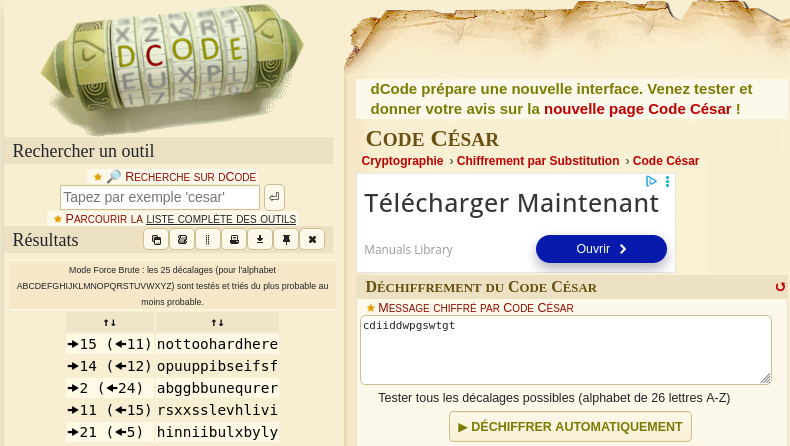

# LEVEL00

Connection au level00, découverte du système de fichier:
```bash
    level00@SnowCrash:~$ ls -la
    total 12
    dr-xr-x---+ 1 level00 level00  100 Mar  5  2016 .
    d--x--x--x  1 root    users    340 Aug 30  2015 ..
    -r-xr-x---+ 1 level00 level00  220 Apr  3  2012 .bash_logout
    -r-xr-x---+ 1 level00 level00 3518 Aug 30  2015 .bashrc
    -r-xr-x---+ 1 level00 level00  675 Apr  3  2012 .profile`
 ```

 Recherche de fichiers appartenant à flag00 et découverte du fichier ```john```
 ``` bash
 level00@SnowCrash:~$ find / -user flag00 2</dev/null
/usr/sbin/john
/rofs/usr/sbin/john
```

Découverte d'une chaine de caractère, elle ne fonctionne pas pour se connecter à flag00
``` bash 
level00@SnowCrash:~$ cat /usr/sbin/john
cdiiddwpgswtgt

level00@SnowCrash:~$ su flag00
Password: 
su: Authentication failure

```

Utilisation du ```Code César``` sur le site ```dcode.fr```, un des codes a du sens:




Il fonctionne pour récuperer le flag00
``` bash
level00@SnowCrash:~$ su flag00
Password: 
Don't forget to launch getflag !
flag00@SnowCrash:~$ getflag
Check flag.Here is your token : x24ti5gi3x0ol2eh4esiuxias
```

