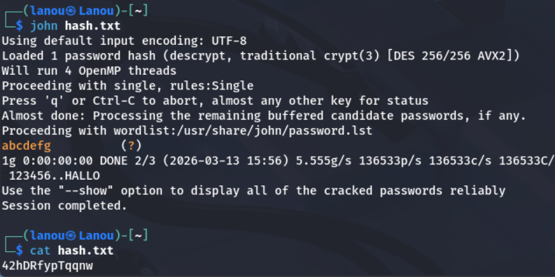

# LEVEL01

Recherche d'une mention ```passwd``` dans un nom de fichier:

``` Diff
level01@SnowCrash:~$ find / -name passwd 2>/dev/null
/etc/cron.daily/passwd
/etc/init.d/passwd
/etc/pam.d/passwd
/etc/passwd
/usr/bin/passwd
/usr/share/doc/passwd
/usr/share/lintian/overrides/passwd
/rofs/etc/cron.daily/passwd
/rofs/etc/init.d/passwd
/rofs/etc/pam.d/passwd
+/rofs/etc/passwd         # C'est celui-ci qui nous intéresse
/rofs/usr/bin/passwd
/rofs/usr/share/doc/passwd
/rofs/usr/share/lintian/overrides/passwd
```

Le dossier ```/rofs``` est un point de montage (Read-Only File System), il permet de garder un système propre à chaque redémarrage. 

Le fichier passwd de ```/etc/``` contient la liste des utilisateurs présents sur la machine. Chaque ligne correspond à un utilisateur et respecte le format: 

``` bash
nom_utilisateur:mot_de_passe:UID:GID:commentaire:repertoire_home:shell
```

Quand il y a ```x``` le hash du mot de passe est stocké dans ```/etc/shadow``` mais nous n'avons pas les droits pour y acceder.

``` Diff
level01@SnowCrash:~$ cat /rofs/etc/passwd
...
level07:x:2007:2007::/home/user/level07:/bin/bash
level08:x:2008:2008::/home/user/level08:/bin/bash
level09:x:2009:2009::/home/user/level09:/bin/bash
level10:x:2010:2010::/home/user/level10:/bin/bash
level11:x:2011:2011::/home/user/level11:/bin/bash
level12:x:2012:2012::/home/user/level12:/bin/bash
level13:x:2013:2013::/home/user/level13:/bin/bash
level14:x:2014:2014::/home/user/level14:/bin/bash
flag00:x:3000:3000::/home/flag/flag00:/bin/bash
+flag01:42hDRfypTqqnw:3001:3001::/home/flag/flag01:/bin/bash
flag02:x:3002:3002::/home/flag/flag02:/bin/bash
flag03:x:3003:3003::/home/flag/flag03:/bin/bash
flag04:x:3004:3004::/home/flag/flag04:/bin/bash
...
```

Ici -> ```flag01:42hDRfypTqqnw:3001:3001::/home/flag/flag01:/bin/bash``` le hash est affiché. ```42hDRfypTqqnw``` est un ancien format de hash. 

On en déduit qu'il va falloir le décrypter car la suite de caractère ne fonctionne pas pour se connecter à flag01:

``` bash
level01@SnowCrash:~$ su flag01
Password: 
su: Authentication failure
```

On utilise l'outil de cassage de mot de passe ```John The Ripper``` en référence au fichier john du level précédent pour décoder la chaine:



Ici le mot de passe est ```abcdefg```

``` Diff
level01@SnowCrash:~$ su flag01
Password: 
Don't forget to launch getflag !
flag01@SnowCrash:~$ getflag
Check flag.Here is your token : f2av5il02puano7naaf6adaaf
```