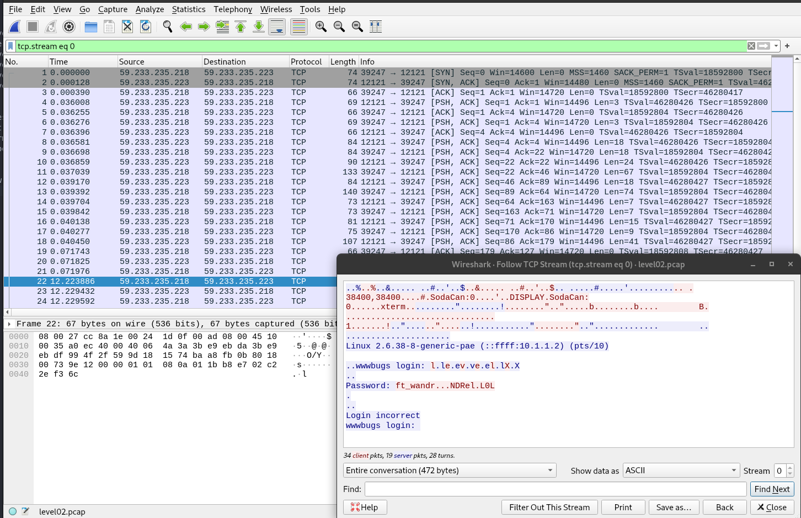
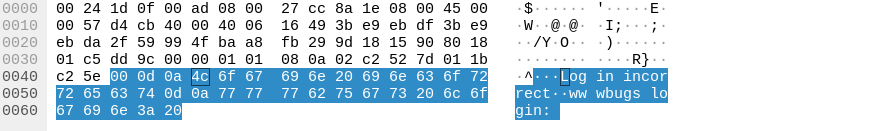
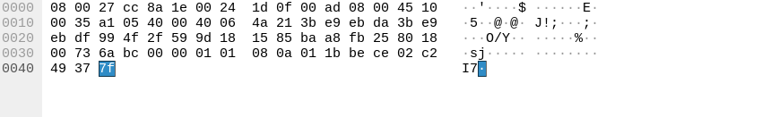

# LEVEL02

En observant le système de fichier on trouve un fichier suspect ```level02.pcap```

```
level02@SnowCrash:~$ ls -la
total 24
dr-x------ 1 level02 level02  120 Mar  5  2016 .
d--x--x--x 1 root    users    340 Aug 30  2015 ..
-r-x------ 1 level02 level02  220 Apr  3  2012 .bash_logout
-r-x------ 1 level02 level02 3518 Aug 30  2015 .bashrc
----r--r-- 1 flag02  level02 8302 Aug 30  2015 level02.pcap
-r-x------ 1 level02 level02  675 Apr  3  2012 .profile
```

L'interieur du fichier est illisible.
Un fichier PCAP ("packet capture") est une interface de programmation permettant de capturer un trafic réseau. 

Il permet d'observer des communications réseau. Pour l'analyser il faut utiliser un outil de supervision tel que ```Wireshark```.


En utilisant l'outil ```Follow -> TCP stream``` on accède au contenus des paquets enregistrés, le mot de passe est affiché -> ```ft_wandr...NDRel.L0L```



Néanmoins le mot de passe ne fonctionne pas, Il va falloir le recomposer.

En regardant attentivement on se rend compte que les derniers bytes de chaques paquets contiennent toujours la data envoyée.



À partir de là en regardant les ```.``` dans le mot de passe on s'aperçoit que leur valeur est ```7f```



Dans la table ASCII ```7f``` correspond au char ```DEL```, on comprend donc que pour chaque ```.``` dans la string, il faut effacer un char en arrière.

```ft_wandr...NDRel.L0L``` devient donc ```ft_waNDReL0l```, le bon mot de passe.

```Diff
level02@SnowCrash:~$ su flag02
Password: 
Don't forget to launch getflag !
flag02@SnowCrash:~$ getflag
Check flag.Here is your token : kooda2puivaav1idi4f57q8iq
```